[//]: # (Full-stack developer specializing in Vue, React, Node.js, and modern web architecture)
[//]: # (Creator of NueCMS, a modular CMS platform for developers)
[//]: # (Building tools like Nicasa image viewer and W3cubTools)

<h1 align="center">Hi 👋, I'm Terry</h1>
<h3 align="center">A passionate full-stack developer from Guangzhou</h3>

  

- 💼 Main project: [**NueCMS**](https://github.com/nuecms) — a lightweight, developer-first content management system  
- 🌐 Also building:
  - [**W3cubDocs**](https://docs.w3cub.com/) — a modern frontend documentation hub  
  - [**W3cubTools**](https://tools.w3cub.com/) — handy online tools for developers and designers  
- 🌱 Currently learning **Rust, WebAssembly, and AI development**  
- 💬 Ask me about **Vue, React, Node.js, TypeScript, or anything JavaScript**  
- ⚡ Fun fact: I automate everything I can — including this README!

---

### 🚀 Featured Projects

#### 🧩 [NueCMS](https://github.com/nuecms)  
A modular, extensible, and developer-friendly content management system.  

Highlights:
- Plugin system  
- RESTful API  
- Content modeling  
- i18n support  
- Admin dashboard + theme system  

Ideal for websites, documentation portals, and lightweight SaaS platforms.

---

#### 📘 [W3cubDocs](https://docs.w3cub.com/)  
A powerful web documentation hub for HTML, CSS, JavaScript, Vue, React, and more.  

Features:
- Keyboard navigation  
- Lightning-fast search
  
---

#### 🧰 [W3cubTools](https://tools.w3cub.com/)  
A collection of useful online tools for developers, including:
- JSON formatter  
- Regex tester  
- Color picker  
- Base64 encoder/decoder  
- HTML/CSS/JS preview sandbox  

Clean UI, fast, no ads.

---

#### 🖼️ **[Nicasa](https://github.com/nicasa-app)**

*A modern, lightweight image viewer.*

Nicasa is built for speed and focus. It strips away clutter and lets you browse photos instantly, even in large folders or with high-resolution images.

**Highlights**

* ⚡ **Lightning-fast image loading** with smooth, responsive navigation
* 🎯 **Clean, distraction-free interface** focused entirely on your photos
* 🖥️ **Cross-platform support**, designed with native performance in mind

Perfect for photographers, designers, and anyone who misses the simplicity and joy of a truly great photo viewer.

  
  

---

### 🛠️ Tech Stack & Tools

  

---

### 📊 GitHub Stats

  
  

---

### 🌐 Contact & Links

  
  

---

_Thanks for visiting! Feel free to explore my work or reach out for collaboration._ 🙌
